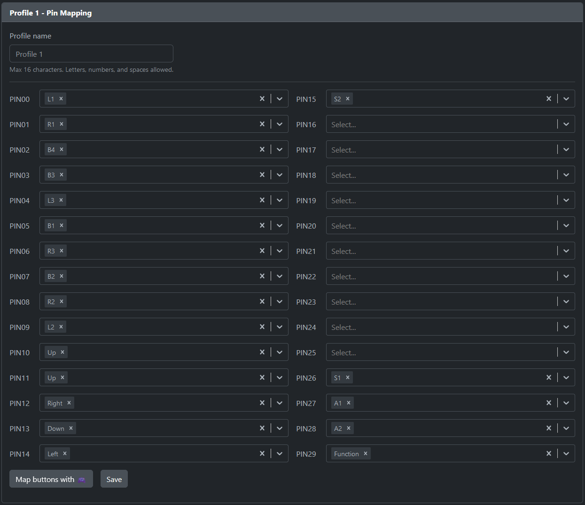

# triplejump

Leverless (box-style) fighting game controller with three jump options.

`TODO: One or more images`

## About

This controller is distinguished by its split-hand configuration and angled keyclusters, mitigating the RSI-potential of the standard "hands-together-but-parallel" layout popularized by the Hitbox. The goal is to keep the entire device relatively small while still providing a meaningful ergonomic benefit.

Another unusual aspect of the layout is the 10 button right hand cluster. The closeness of the keys in this keyboard-like format makes multi-key inputs (e.g., `LP+LK`) harder than usual to press. Promoting `R3` and `L3` into "first class" buttons mitigates this drawback by providing more locations for macros (the legal kind you can map in-game).

Lastly are the titular three up buttons. Really, this is just for player comfort. Some prefer a `WASD` jump and others prefer a thumb jump. If concerned about being DQ'd for having more than one (i.e., under CPT rules), just remove the two switches you don't personally use.

Powering this device is OpenStick's excellent [GP2040-CE](https://github.com/OpenStickCommunity/GP2040-CE) gamepad firmware. Please see that repository for information about configuration, console compatibility, and all the rest.

## Creation

If you want to produce one, you will need some parts.

### PCB

- 1x triplejump PCB, created using the [gerbers.zip](./prod/gerbers.zip) files with an online PCB prototyping service. (e.g., [JLCPCB](https://jlcpcb.com/).)
- 1x [RP2040-Zero](https://www.waveshare.com/rp2040-zero.htm).
- 6x 6x6mm Panel PCB Momentary Tactile Mini Push Button Switch DIP 4pin.
- 16x Kailh Choc v1 Hotswap Sockets (PG1350).

### Keys

- 16x Kailh Choc v1 Switches (recommended: linear switches with low actuation force).
- 14x Kailh Choc-compatible 1u Keycaps.
- 2x Kailh Choc-compatible 1.5u Keycaps.

### Case

This case was designed with MBK profile Choc keycaps in mind and may or may not be compatible with other keycaps.

- 3D Printed Case [Top](<./prod/case-top-hipro (repaired).stl>) and [Bottom](<./prod/case-bottom (repaired).stl>).
- 4x M3 x 10mm Screws. `[TODO: Verify this is correct] `
- 4x M3 Nuts. `[TODO: Verify this is correct] `
- OPTIONAL: Non-slip Feet or Pads.

### Assembly

- Soldering Equipment.
- Screwdriver.

### Firmware

- The [Latest GP2040-CE Release](https://github.com/OpenStickCommunity/GP2040-CE/releases), flashed accoridng to the documentation.
- Pin (Button) Mapping using GP2040-CE's [Web Configurator](https://gp2040-ce.info/#/web-configurator)
  - There is a catch: the firmware assumes a default pin mapping that the triplejump does not use. Until you've remapped the pins, you must hold down R3 instead of S2 (Start) when plugging in the controller to enter the configurator.
  - You could also short pin 1 to ground manually if you haven't installed the switches yet when setting up the firmware.
  - The correct mapping for the triplejump is shown below.

## Mods

If you wanted to fork this project, these mods should be fairly straightfoward:

- Changing from Choc keyswitches to standard MX-style switches.
  - I used MX-standard 19.05mm switch spacing everywhere, which should help.
  - You'd still need to change the footprints on the PCB and modify the case.
- Case design improvements.
  - This was my first time designing or 3D printing anything, it could surely be improved by someone with more experience.
- Removing one or more jump buttons from the case design.
  - If you don't install all 3, a modified case would look less janky.

## Acknowledgments

- [GrooveBob](https://github.com/GroooveBob)'s [Stress](https://github.com/GroooveBob/Stress), which helped inspire this design.
- [jfedor2](https://github.com/jfedor2)'s [Flatbox](https://github.com/jfedor2/flatbox), which helped inspire this design.
- [Afternoon Labs](https://github.com/afternoonlabs)' [Breeze](https://github.com/afternoonlabs/BreezeKeyboard), which helped inspire this design and whose switch layout it mimics.
- [ruiqimao](https://github.com/ruiqimao)'s [Keyboard PCB Guide](https://github.com/ruiqimao/keyboard-pcb-guide), which led me through the entire PCB creation process.
- [crides](https://github.com/crides)'s [Kleeb](https://github.com/crides/kleeb) Kicad library, whose symbols and footprints are present in the PCB schematic and design.
- [daprice](https://github.com/daprice)'s [keyswitches.pretty](https://github.com/daprice/keyswitches.pretty) Kicad library, whose footprints are present in the PCB design. [CC BY 4.0](https://creativecommons.org/licenses/by/4.0/)
- [OpenStickCommunity](https://github.com/OpenStickCommunity)'s [GP2040-CE](https://github.com/OpenStickCommunity/GP2040-CE), whose firmware makes the silicon useful and whose Discord community was extremely helpful.
